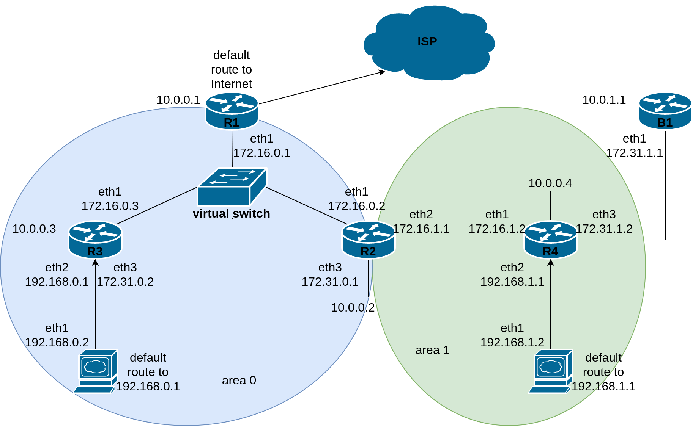
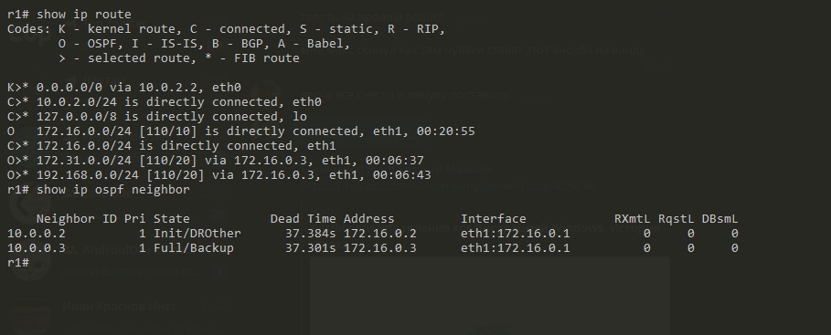
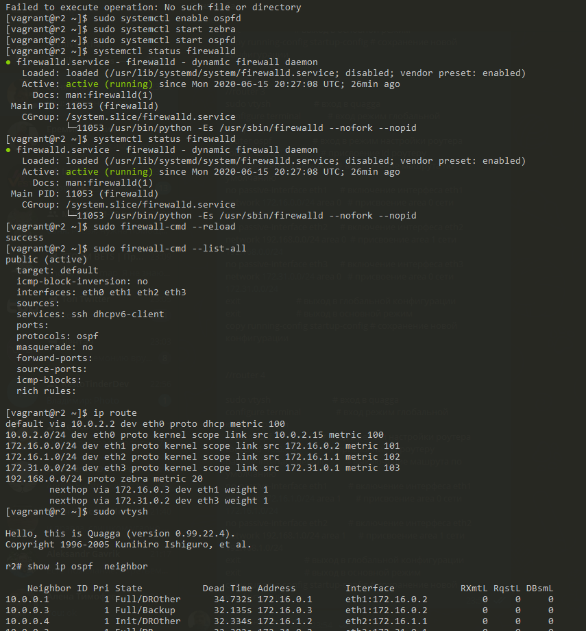
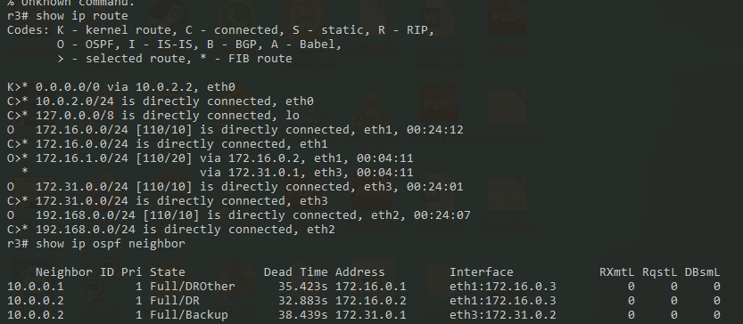
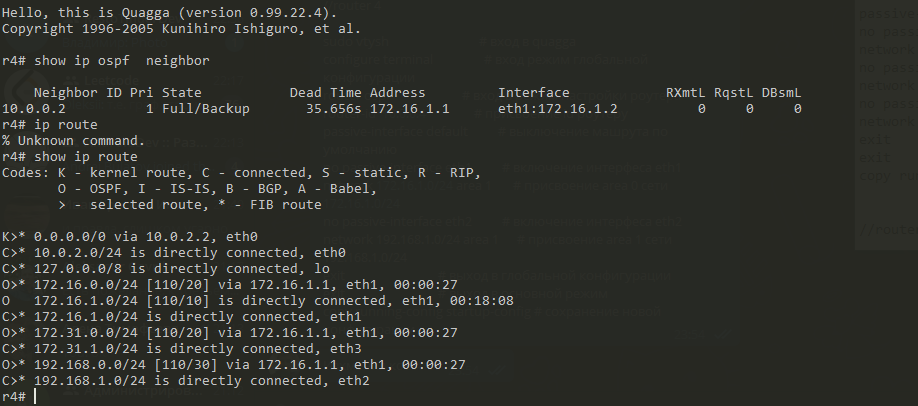

# Лабораторная работа 2

## Схема сети



### Настройка на все роутеры
```

cat /proc/sys/net/ipv4/ip_forward
sudo bash -c 'echo 1 > /proc/sys/net/ipv4/ip_forward'
sudo yum install nano -y
sudo nano /etc/sysctl.d/router.conf

net.ipv4.ip_forward = 1
net.ipv4.conf.all.forwarding = 1
net.ipv4.conf.all.rp_filter = 2


sudo yum install quagga -y
sudo touch /etc/quagga/ospfd.conf
sudo chown quagga:quagga /etc/quagga/ospfd.conf && sudo chmod 640 /etc/quagga/ospfd.conf

sudo systemctl enable zebra
sudo systemctl start zebra
sudo systemctl enable ospfd
sudo systemctl start ospfd

systemctl status firewalld
sudo systemctl start firewalld
sudo firewall-cmd --add-protocol=ospf --permanent
sudo firewall-cmd --reload
sudo firewall-cmd --list-all
```
### Первый роутер (R1)
```
sudo vtysh                    		
configure terminal            		
router ospf                   		
router-id  10.0.0.1           		
passive-interface default     		
network 172.16.0.0/24 area 0  		
no passive-interface eth1     		
default-information originate 		
exit                          		
exit                          		
copy running-config startup-config 	
exit                          		

sudo iptables -t nat -A POSTROUTING -o eth1 -j MASQUERADE 



### Второй роутер (R2)
```
sudo vtysh                    	
configure terminal            	
router ospf                   		
router-id  10.0.0.2           		
passive-interface default     	
no passive-interface eth1     		
network 172.16.0.0/24 area 0  		
no passive-interface eth2     		
network 172.16.1.0/24 area 1  		
no passive-interface eth3     		
network 172.31.0.0/24 area 0  	
exit                          		
exit                          		
copy running-config startup-config 	

### Третий роутер (R3)
```
sudo vtysh                     		
configure terminal             		
router ospf                    		
router-id  10.0.0.3            		
passive-interface default      		
no passive-interface eth1      		
network 172.16.0.0/24 area 0   		
no passive-interface eth2      		
network 192.168.0.0/24 area 0  	
no passive-interface eth3      		
network 172.31.0.0/24 area 0   		
exit                           		
exit                           		
copy running-config startup-config 	


### Четвёртый роутер (R4)
```
sudo vtysh                         	
configure terminal                 
router ospf                        	
router-id  10.0.0.4                	
passive-interface default          	
no passive-interface eth1          	
network 172.16.1.0/24 area 1       	
no passive-interface eth2          	
network 192.168.1.0/24 area 1      	
exit                              
exit                               	
copy running-config startup-config 


